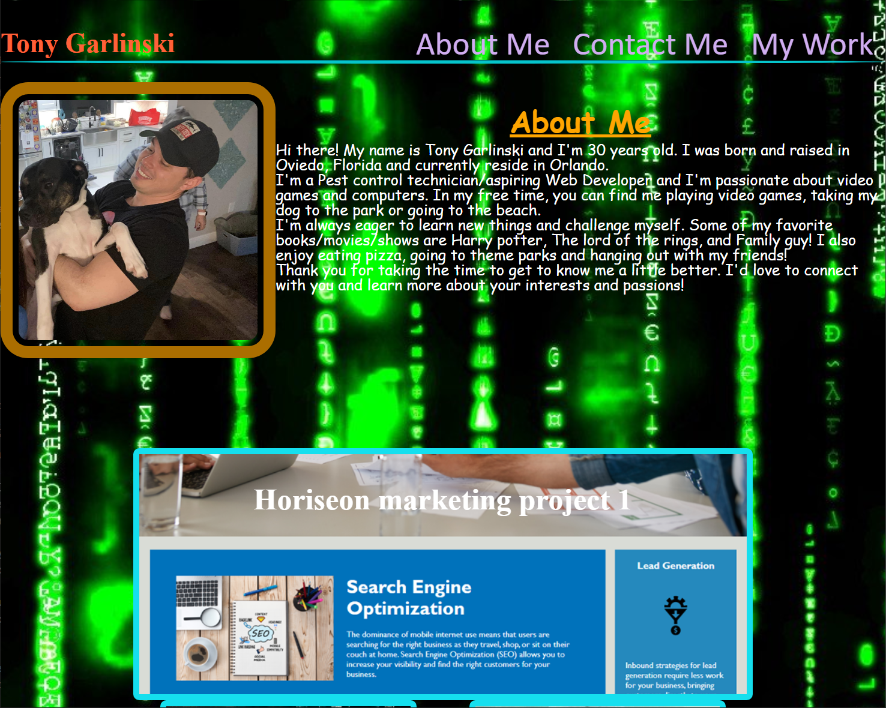

# About-me-project-challenge

## Description
This is a portfolio website showcasing my previous work. It includes the my name, a recent photo or avatar, and links to sections about me, my work, and how to contact me. 
I built this application for any future employers to preview my previous work. I learned how to use flex box and psuedo classes effectivley.

## Installation

In order to get the development enviorment running you will need to clone the repository from my git hub[link]https://github.com/tbone2311/About-me-project-challenge through your terminal, after cloning the repository open the directory in VS-code.
## Usage

About me
In this section, you will find information about me, including their background, education, and experience. Additionally, you will find a recent photo or avatar.

Work Samples
This section showcases my applications with titled images. The first application's image is larger in size than the others. When you click on the images of the applications, you will be taken to the deployed application.

Contact
In this section, you will find information on how to contact the me.

Navigation
The website has a navigation bar that allows you to easily access each section. When you click on a link in the navigation, the UI will scroll to the corresponding section.

Responsive Design
The website is designed to be responsive and adapt to your viewport. It will provide a consistent user experience whether you are viewing the site on a desktop, tablet, or mobile device.

## Credits
https://www.youtube.com/watch?v=phWxA89Dy94
https://www.w3schools.com/css/css_pseudo_classes.asp

## License
N/A

---
